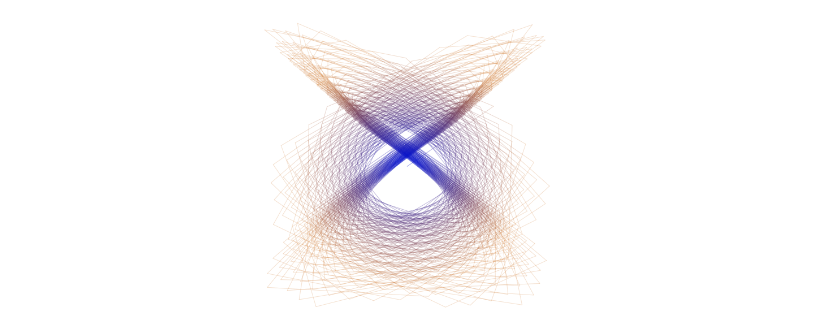

# Harmonograph
[*Wikipedia Article*](https://en.wikipedia.org/wiki/Harmonograph)

## Overview
A harmonograph is basically a series of pendulums. The equation for a single pendulum is as follows:

`p(t) = amplitude * sin(t*frequency + phase) * Math.exp(-(damping*t));`

Where:
* the amplitude changes how large the swings are
* the frequency dictates the shape of the curve
* the phase...
* the damping indicates how much energy it has before it ultimately stops changing.

Thus for a two axis harmonograph it's on two pendulums and to factor in superposition we have to add the values of both waves:

`x(t) = amplitude * sin(t*frequency + phase) * Math.exp(-(damping*t));`
`y(t) = amplitude * cos(t*frequency + phase) * Math.exp(-(damping*t));`

## Experiments
These are some of my favorite harmonograph images. Let me know if you find anymore good ones!

### 
```js
const xParams = [generatePendulumParams(1,0,100,0.001), generatePendulumParams(1,1,125,0.001)];
const yParams = [generatePendulumParams(-1,2,125,0.001), generatePendulumParams(-0.8,3,100,0.001)];
```

### X Marks the Spot


It's quite interesting the shapes you get when you don't convert the frequency into radians. The final shape is a lot less natural.

```js
const xParams = [generatePendulumParams(1.5,1,150,0.001), generatePendulumParams(1.5,1,150,0.001)];
const yParams = [generatePendulumParams(1,1,150,0.001), generatePendulumParams(1,1,150,0.001)];
```